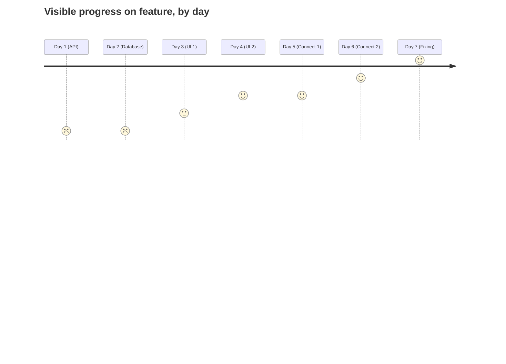
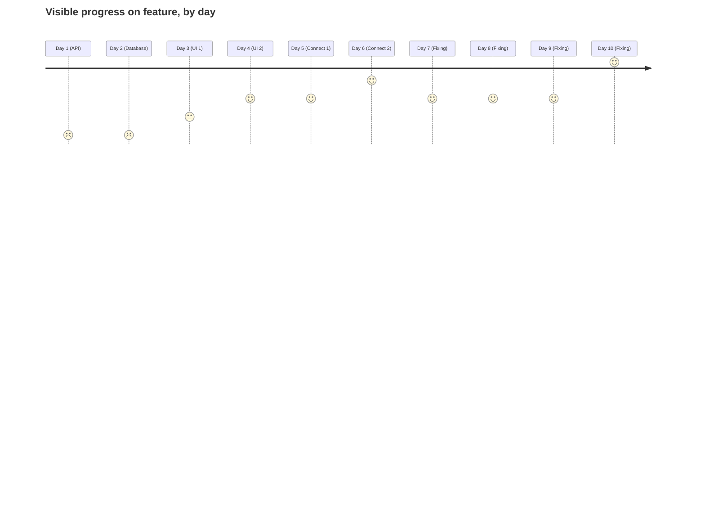

In the last ~20 years, MVP releases have finally become the standard way of developing software. However, this technique can be taken further, and used as a way to work on an individual ticket or feature, even as a solo dev. Why? Well, here's my motivation...

## How are features traditionally developed?

First of all, a clarification on what I mean by using MVP on an individual ticket. I **don't** mean releasing simple versions of small features, although that may be beneficial. Instead, I mean the concepts behind MVP development can be used whilst implementing a new feature, even if it is only a few days work.

For example, perhaps you need to build a new checkout flow. The obvious sub-tasks, with time taken, might be:
1. 1 day: Implement the API calls, using fake triggers.
2. 1 day: Perform any local database schema changes and migrations, using fake data.
3. 2 days: Build any UI according to the design, using fake data.
4. 2 days: Connect these all together.
5. 1 day: Test, fix any problems that are uncovered.

This works! The feature is delivered, and so long as the specifications were perfectly defined, it's probably the best approach.

Here's a representation of this workflow. The x-axis is time, y-axis is externally visible progress, where the horizontal line represents completion.

## What's wrong with that approach?

### External and internal progress
With this approach, the progress that can be shown to product managers / stakeholders is only on the UI related days. Instead of being a steady progression, the progress seems to move in jumps. For example, it looks like zero progress is being made the first 2 days, when this is actually probably the most challenging work.

### Ill-defined work
Additionally, in the real world tickets... sometimes aren't so well defined. Perhaps you need to talk to an API that isn't quite finished yet. Perhaps the design is still subject to change. Perhaps you need to coordinate your changes with other features affecting a database. All of this leads to work being redone in step 5, and seemingly almost finished tickets getting "stuck" in an unfinished state.

This means our diagram might end up looking more like:

## What's an alternative?

Instead of building each part of the feature in isolation, and then wiring them together, what if you do the wiring first? This leaves us with sub-tasks of:
1. 1 day: Add a placeholder button, add placeholder database fields, and the bare essentials needed for an API call.
2. 1 day: Connect these all together.
3. 1 day: Finish API work "good enough".
4. 1 day: Finish Database work "good enough".
5. 1 day: Finish UI work "good enough".
6. 1 day: Test, fix any problems that are uncovered.
7. 1 day: Refactor / tidy up all work from "good enough" to "finished".

Okay, so our feature took 7 days before, and now takes... 7 days. How is this any better? Well, the end result is about the same, but with a few advantages during development.

## What're the advantages?

### No nasty surprises at the end!

Sometimes, features have unexpected issues. Perhaps it's an unexpected error scenario, perhaps it's a design / API change, it can be almost anything. 

Using the initial approach, if we've already finished & tidied that aspect of the feature, any changes require redoing work and wasting time. Using the MVP approach, 

### Testing throughout

### Progress visible to all

### Changes aren't as destructive