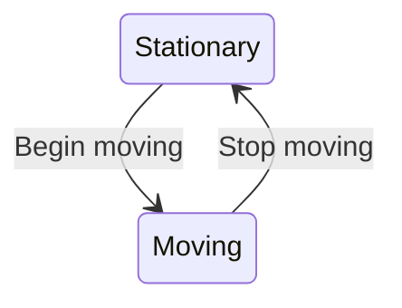
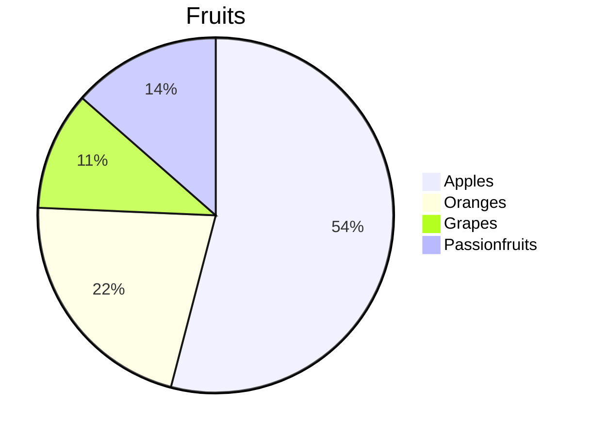
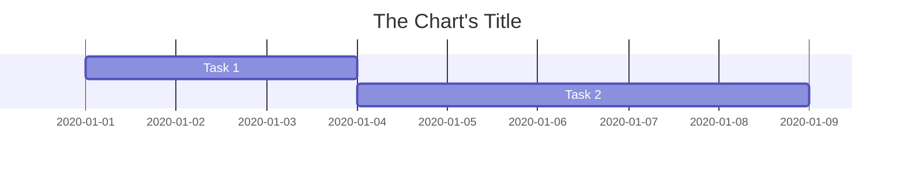

On most larger software projects, at some point you'll probably need to use a diagram on GitHub. Whether it's explaining how components interact, a user's flow, or project timelines, it'll happen eventually, usually in a PR.

In the past I've used something like LucidChart or Miro, then embedded the image and linked to the original file. However, this means a whole new set of access controls, reliance on a (often paid!) third party, and is overall a pretty bad experience.

## Mermaid

However, there's another option, [Mermaid](https://mermaid-js.github.io/mermaid/#/)! It lets you embed diagrams using intuitive, markdown-ish code. This means you get all the advantages of git, but for gantt charts, timelines, pie charts, database diagrams, flowcharts, etc! 

To use it on non-GitHub sites (like this one) you need to embed the JavaScript and use a div with the `mermaid` class ([official instructions](https://mermaid-js.github.io/mermaid/#/n00b-gettingStarted?id=requirements-for-the-mermaid-api)), whilst on GitHub a code block with `mermaid` is enough.

## Examples

For example, adding a few lines describing a state diagram:

~~~markdown

~~~

Will give you a simple but usable diagram! It's not an image, it's done in CSS so it can be styled, the text can be copied, you can access it via JavaScript, etc.

stateDiagram-v2
    Stationary --> Moving : Begin moving
    Moving --> Stationary : Stop moving

Similarly, to easily compare the distribution of some values in a pie chart:

~~~markdown

~~~

gives 

pie
    title Fruits
    "Apples" : 50
    "Oranges" : 20
    "Grapes" : 9.99
    "Passionfruits" : 12.5

Finally, for scheduling work, the very concise:

~~~markdown

~~~

gives

gantt
    title The Chart's Title
    Task 1: a1, 2020-01-01, 3d
    Task 2: a2, after a1, 5d

## Cheatsheets

To learn the capabilities of Mermaid, I [wrote cheatsheets for all supported Mermaid charts](https://github.com/JakeSteam/Mermaid). They can all be embedded in GitHub PRs / issues / wiki pages, and include:

* [Flowcharts](https://github.com/JakeSteam/Mermaid/blob/main/flowchart.md)
* [Sequence Diagrams](https://github.com/JakeSteam/Mermaid/blob/main/sequence.md)
* [Class Diagrams](https://github.com/JakeSteam/Mermaid/blob/main/class.md)
* [State Diagrams](https://github.com/JakeSteam/Mermaid/blob/main/state.md)
* [Entity Relationship Diagrams](https://github.com/JakeSteam/Mermaid/blob/main/entity-relationship.md)
* [User Journey Diagrmas](https://github.com/JakeSteam/Mermaid/blob/main/user-journey.md)
* [Gantt Chart Diagrams](https://github.com/JakeSteam/Mermaid/blob/main/gantt.md)
* [Pie Charts](https://github.com/JakeSteam/Mermaid/blob/main/pie.md)
* [Requirement Diagrams](https://github.com/JakeSteam/Mermaid/blob/main/requirement.md)
* [Git Graphs](https://github.com/JakeSteam/Mermaid/blob/main/git.md)

## Tips

Finally, I wanted to mention a few things I discovered whilst learning Mermaid's capabilities. 

Firstly, since Mermaid is essentially a Markdown extension, [extensions](https://marketplace.visualstudio.com/items?itemName=bierner.markdown-mermaid) for VS Code (and other text editors) exist for realtime previewing. This makes writing them very easy, but be aware that the local preview CAN differ slightly from GitHub's. For example, the Gantt chart above doesn't work locally for... unknown reasons. Maybe differing Mermaid renderers?

Secondly, the official documentation quality varies a bit. For example every aspect of [flowcharts](https://mermaid-js.github.io/mermaid/#/flowchart) are documented, whilst [user journey](https://mermaid-js.github.io/mermaid/#/user-journey) has a single example. The git graph feature is experimental, and isn't in their documentation at all! 

Thirdly, whilst it is extremely powerful, it has quirks. For example when included in a table it seems to reserve space for itself at full size, then shrink down, leaving a big gap:

Finally, the changelog on the documentation site is very outdated. New versions are [being regularly released](https://github.com/mermaid-js/mermaid/releases), with lots of features and fixes!

## Summary

Overall, I can't believe this GitHub feature isn't more widely known. Being able to include diagrams of classes, databases, user journeys etc in a PR / wiki without a third party service is something I've desperately needed! The fact that they're just code also means they can be stored with the codebase, instead of a `/images/` folder or hosted elsewhere.

I intend to convert all of my third party diagrams to Mermaid ASAP, so they can be properly tracked / access controlled, whilst also being far easier to work with than a GUI driven tool. Viva la mermaid! 