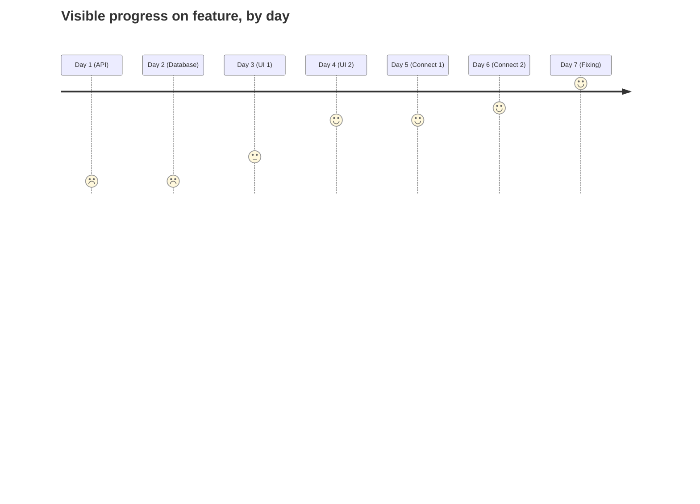
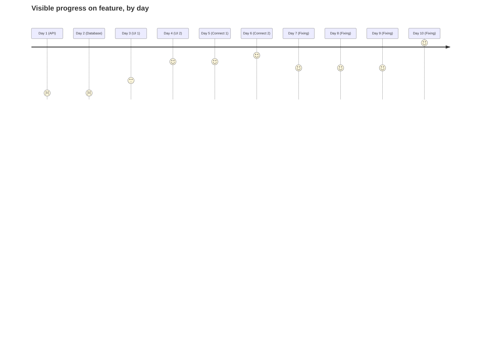
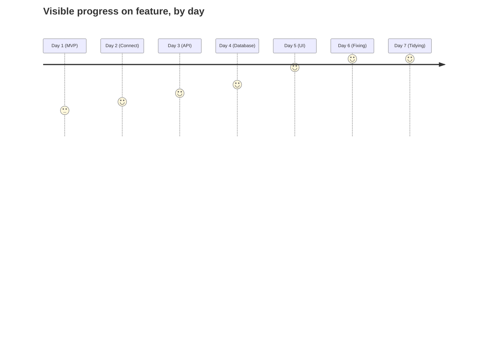

In the last ~20 years, MVP releases have thankfully become the standard way of developing software. However, this mindset can be taken further, and used as a way to work on an individual ticket or feature, even as a solo dev. Why? Well, here's a whole post full of motivations...

## The traditional approach

First of all, a clarification on what I mean by using MVP on an individual ticket. I **don't** mean releasing simple versions of small features, although that may be beneficial. Instead, I mean the concepts behind MVP development can be used whilst implementing a new feature, even if it is only a few days work.

For example, perhaps you need to build a new checkout flow. The obvious sub-tasks, with time taken, might be:
1. 1 day: Implement the API calls, using fake triggers.
2. 1 day: Perform any local database schema changes and migrations, using fake data.
3. 2 days: Build any UI according to the design, using fake data.
4. 2 days: Connect these all together.
5. 1 day: Test, fix any problems that are uncovered.

This works! The feature is delivered, and so long as the specifications were perfectly defined, it might be the best approach.

Here's a representation of this workflow. The x-axis is time, y-axis is externally visible progress, where the thick black line represents completion.





## What's wrong with it?

### Obfuscated progress
With this approach, the progress that can be shown to product managers / stakeholders is only on the UI related days. Instead of being a steady progression, the progress seems to move in jumps. For example, it looks like zero progress is being made the first 2 days, when this is actually probably the most challenging work.

### Ill-defined work
Additionally, in the real world tickets... sometimes aren't so well defined. Perhaps you need to talk to an API that isn't quite finished yet. Perhaps the design is still subject to change. Perhaps you need to coordinate your changes with other features affecting a database. All of this leads to work being redone in the final step, and almost finished tickets seemingly getting "stuck" in an unfinished state for days.

This means any changes might cause our progress to end up looking more like:





Not very encouraging or predictable for the developer or stakeholders!

## What's the MVP approach?

Instead of building each part of the feature in isolation and then wiring them together, what if you do the wiring first? This leaves us with sub-tasks of:
1. 1 day: Add a placeholder UI, add placeholder database fields, and the bare essentials needed for an API call.
2. 1 day: Connect these all together.
3. 1 day: Finish API work "good enough".
4. 1 day: Finish Database work "good enough".
5. 1 day: Finish UI work "good enough".
6. 1 day: Test, fix any problems that are uncovered.
7. 1 day: Refactor / tidy up all work from "good enough" to "finished".

Okay, so our feature took 7 days before, and now takes... 7 days. How is this any better? Well, the end result is about the same, but with a few advantages during development.

## What're the advantages?

### Daily progress visible to all

An immediate and selfish benefit is the motivational boost gained from seeing visible progress day by day instead of merely knowledge that a certain class now performs as expected. Arguably more importantly however, this progress is also visible to anybody who is interested. Whether this is from automated CI/CD builds or manual demos, being able to visually show your progress to a non-technical audience at any time is a crucial ability for building trust and reliability.





### No nasty surprises!

Ever got to the very last stage of a feature, then realised a blocker that requires rethinking the whole approach? It's a painful experience, and whilst it ideally should be avoided by rigorous refinement, any traditional way of working on a feature will experience this sometimes.

Using the MVP approach, on the **very first day** you have full confidence the basic idea works. Discovering this on Day 1 vs Day 5/6 can be the difference between a project succeeding or failing, as well as drastically different levels of stress!

### Flexibility until the very end

Features often have unexpected minor issues as they are being finished, perhaps an unexpected error case, or a design / API change. Using the initial approach, if we've already finished & tidied that aspect of the feature any changes require redoing "finished" work and wasting time. Using the MVP approach, all the tidying and refactoring happens at the end, so minor changes are no problem. 

### Testing throughout

By having a (just about) functioning demo of your feature ready from the start, you'll end up testing your own work constantly throughout. Simple bugs like a back button not working will turn up whilst you're trying to implement something else, and by then then you'll fully understand the user flow. This will also give you an insight into any potential performance issues or confusing aspects. Using a traditional approach, you'll only use your feature like a real user during the UI development stage or the fixing at the very end.

### Easier to tidy code

Whilst finishing and tidying sections as you work on them might produce tidier separated sections of code, will they stay that way? During the connecting and fixing stages, the oh-so-clever architecture might suffer from a workaround or two, yet you'll be too deeply invested to refactor it completely.

If you accept that all areas will be tidied during dedicated time at the end, you can instead focus on the actual functionality. This does of course require keeping track of the areas that need tidying, and isn't a license to skip this essential work! The overall architecture also needs planning out in advance regardless of approach.

Tidying once a feature is completed also lets you tidy according to what is best for the entire system, not just each section in isolation. For example, a class you initially thought should be generic can perhaps actually be a concrete implementation, letting you get rid of some earlier messy generic-handling code.

### You could release at any time

I know I just said this approach doesn't give you a license to skip the essential refactoring and tidying, but... you *can* if absolutely necessary. Instead of the feature being utterly useless until the very end, you could technically merge & ship your feature at any point after the first first day. Of course it would be awful, missing features, and be full of bugs, but you have the *capability*!

This shouldn't come up often, but the ability to decide to skip additional functionality and just launch is very powerful.

### Your bus factor improves

Using a traditional approach, the overall approach likely exists in your head for most of the development process. You could build all the components, but if you were [hit by a bus](https://en.wikipedia.org/wiki/Bus_factor) would someone else know how to wire them together? Probably not.

With the MVP approach, the plan is immediately visible. If you disappear halfway through development (e.g. on holiday, somewhat less drastically!) another engineer can likely pick it up with minimal handover. This is especially true during the fixing / tidying stages, where the hard work is already finished.

### Work "breaks" are possible

Usually, if you get stuck whilst developing a feature, you just have to keep trying or pause work on the ticket until you've solved the problem. Using the MVP approach, you can take a "break" by working on another aspect of the ticket, letting your subconscious consider the tricky problem blocking your progress.

I've often found myself stuck on a complex problem and taken a break to do some relatively straightforward UI work, then by the time I get back to my original task the approach is obvious. I actually encourage having "break" tickets anyway (I often use crash fixes), but doing this within the feature avoids starting new work whilst existing work is stuck.

## Conclusion

Whilst this approach clearly has many advantages for the flexibility and visibility of your work, it's not without some downsides.

Non-feature tickets sometimes can't be completed this way, as each section of the work truly does require the previous stages to be completed (e.g. a database schema must be completed before a migration script can be generated). Even for feature tickets, dependencies between stages are sometimes inevitable, so this technique should be a "use if possible" approach, not a "use no matter what".

Finally, this way of working definitely isn't for everyone, and what works best for me might not work at all for you. However, I'd encourage at least giving it a go the next time you have a standalone feature ticket with various parts. You might discover a new way of working!

